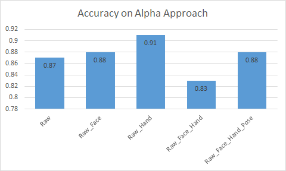

##  Alpha Approach

###  Description 

------

In alpha approach, indiviual frames are extracted from video and labeled as Falling or Non Falling by placing them in their respective folders. The dataset can be found here. [ [train](https://drive.google.com/open?id=1KP7JvYl7f5qWSgrdJjLY8mDMBMjn80X_) , [val](https://drive.google.com/open?id=1ub0WvUS7iKGWhwD_v87DWB7_WP5yxI1e) , [test](https://drive.google.com/open?id=1XBTTeAhT--Fn3BqiJ5A263sR0h41vKwl) ]

### Results

------

