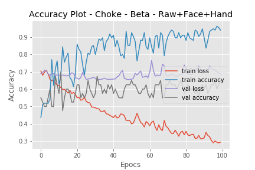

##  Beta Approach

## Raw + Face + Hand

###  Description 

------

Each 10 stacked frames (L) is stacked with heatmaps of face and hand of each stacked frame is passed to the model. [ depth = 30 ]

### Plot

------

