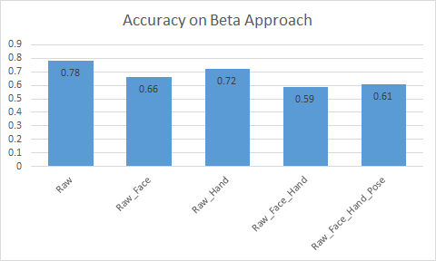

##  Beta Approach

###  Description 

------

In beta approach, indiviual frames are extracted from video, 10 are stacked together, grayscaled and labeled as Falling or Non Falling by placing them in their respective folders. Same approach is used for Choking or Non Choking. The dataset can be found here. [ [train](https://drive.google.com/open?id=1Hja0pafjiNbBfaJz3kL9-ujJfep2h6uJ) , [val](https://drive.google.com/open?id=1VHZnYe01KeC1DDT9BWG4ddJWdpzTjjwa) , [test](https://drive.google.com/open?id=1ZAXkP6XqoR7pgDduxd-TuKcboZ-PFg-i) ]

### Results

------

