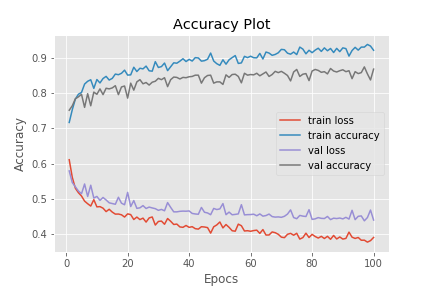
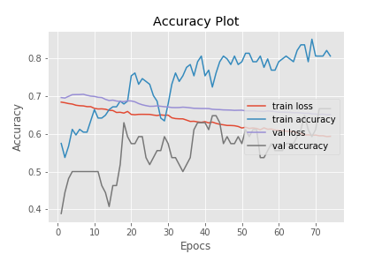
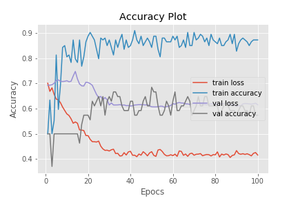
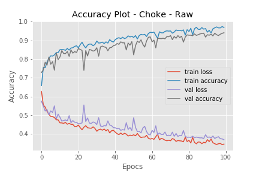
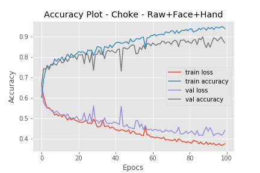
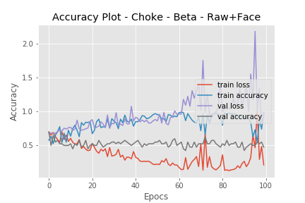
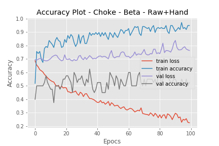
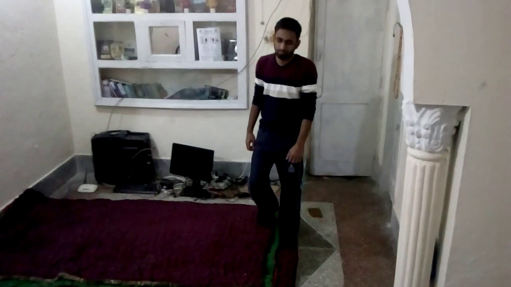
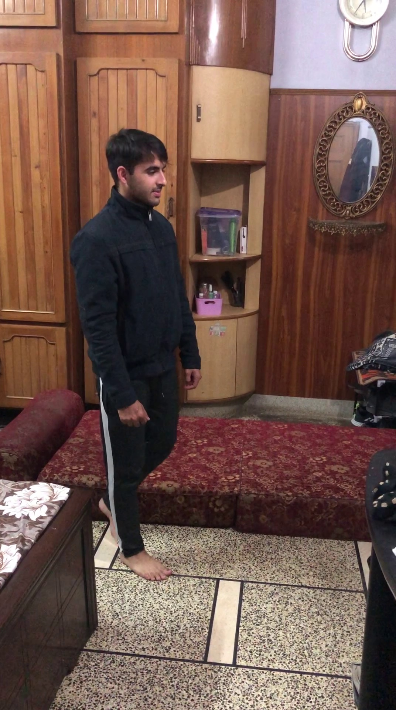
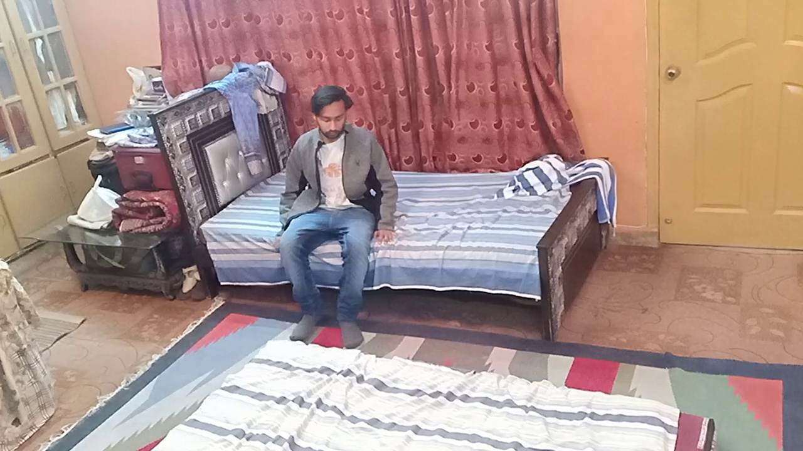

#  DeepAL

##  Deep Learning for Assisted Living

###  Description 

------

This project classifies human activities such as human falling and human choking in order to detect the problems which are most specifically faced by elderly people. The model proposed by this project uses the data which has been augmented by adding additional features introduced by the face, hand positions and keypoint models. We tackle the task component of increasing the accuracy of a model by training it on a small and structured dataset through data augmentation.

### Models

------

- Yolov3 (Darknet) for Face and Hand Detections

- AlphaPose for Key-point Estimations

- Resnet50 for classification of falling/non-falling and choking/non-choking

### Using the model

------

*demo.py* is the output file for testing the model on any of its weights. Testing works for image, video and webcam. When passed through this file, the results images are labelled at the top left of the image with the models predicted class i.e Falling or Non-Falling. The weights can be found [here](https://drive.google.com/open?id=1V3DrJsDEGXWdwETtMQY1hGtkkYwCNgIW)

#### <u>Testing</u>

- For image

`python demo.py --weightF <PathToWeightFall> --image <PathToImage> --aug ###`

- For video

`python demo.py --weightF <PathToWeightFall> --video <PathToVideo> --aug ###`

- For webcam

`python demo.py --weightF <PathToWeightFall> --aug ###`

#### <u>Arguments</u>

--weightF
Path to weight file of Falling model

--weightC
Path to weight file of Choking model

- --aug
2nd place bit - Face , 1st place bit - Hand , 0th place bit - Pose
Enable or disable the bit for model selection.

- --size
integer size for label averaging (default 5)

- --mirror
flip the webcam frame 

#### <u>Utils</u>

Few by-product utilities were also created such as:

- Detect only hands and face on a image can be done via utils/detectHandsFaces.ipynb
- Extracting frames from videos and storing them to given destination can be achieved via utils/ExtractFrames.ipynb

### Results

------

#### FALL

##### Plots Alpha Approach

- Raw

- Raw + Face + Hand

##### Plots Beta Approach

- Raw + Face

- Raw + Hand

#### Choke

##### Plots Alpha Approach

- Raw

- Raw + Face + Hand

##### Plots Beta Approach

- Raw + Face

- Raw + Hand

### Creators

------

<table>
    <td>
      <h3>
        Ahsan Abbas
  </h3>
        
    </td>

   <td>
  <h3>
        Muhammad Arslan
  </h3>
        
   </td>

   <td>
  <h3>
        Govinda Kumar
  </h3>
        
    </td> 

​       
</table>

### Final Year Project

---

This is our final year project for Bachelors of Computer Science 2020.

**Supervisor:**
> Dr Omer Ishaq
> Dr Kashif Saghar

**Group Members:**

> Ahsan Abbas

> Muhammad Arslan 

> Govinda Kumar 
